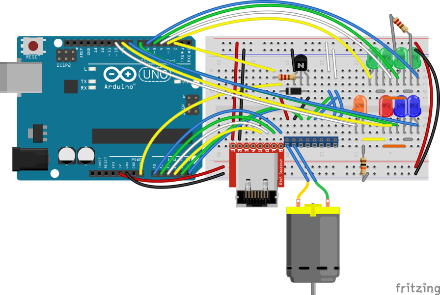

# Tree Waterer

An Arduino-powered system for automatically watering a Christmas tree.

Sucessfully used by me to achieve fully-automatic zero-intervention watering over two Christmas seasons. Just set it up and let it do its thing.

## How it Works

The watering device, consisting of a bucket of water and the main circuitry, sits next to the tree in a box disguised as a Christmas present. Water level sensors are mounted in the tree stand and connected to the Arduino over a Cat 5 cable. When the sensors detect a low water level in the stand, the controller turns on a small water pump in the bucket to pump water into the stand through a length of plastic tubing. It then turns the pump off when the water level sensors again detect water.

The water sensors have four times redundancy, any one of them being enough to stop the pump, ensuring that a sensor failure is unlikely to overflow the stand and ruin the floor or surrounding gifts. Additionally, the sensors are "normally closed", meaning that accidentally unplugging them reads as "stand water full" to the controller, again ensuring that hardware failures don't ruin Christmas.

## The Waterer

Each of the four water level sensors in the stand has a corresponding green LED (LEDs 1-4) on the breadboard that shows its status ("on" for "water detected"). It's normal for some of these to never turn on if some of the sensors are mounted higher than the others. The orange LED5 turns on when the pump is running. LEDs 6-8 are used to indicate water level in the bucket, but they are unused in the current version.

The pump (shown below with a placeholder motor image) connects to the board through a spring terminal block. The block also has spots to plug in water level sensors to use in the bucket, but they are unused in this version.

The sensor board connects via an RJ45 jack.

### Breadboard view

### Schematic

## The Stand

The stand connects to the controller via an RJ45 jack mounted on the outside. On the underside of the stand is a breadboard that splits out the sensors. The sensors are shown as open pushbuttons in the image below. In reality, their switchs are normally closed, and open when water is detected.

The RJ45's pin 1 and the red wire on the left are unused in the current version.

