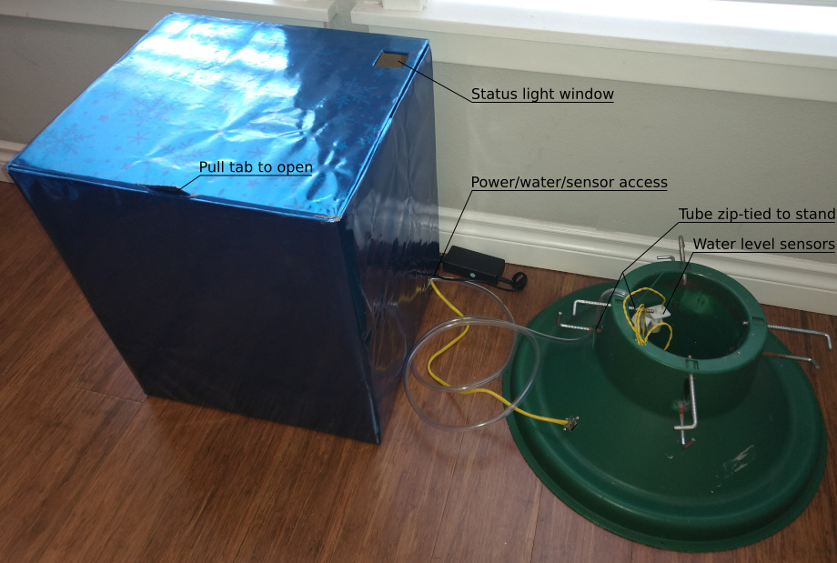
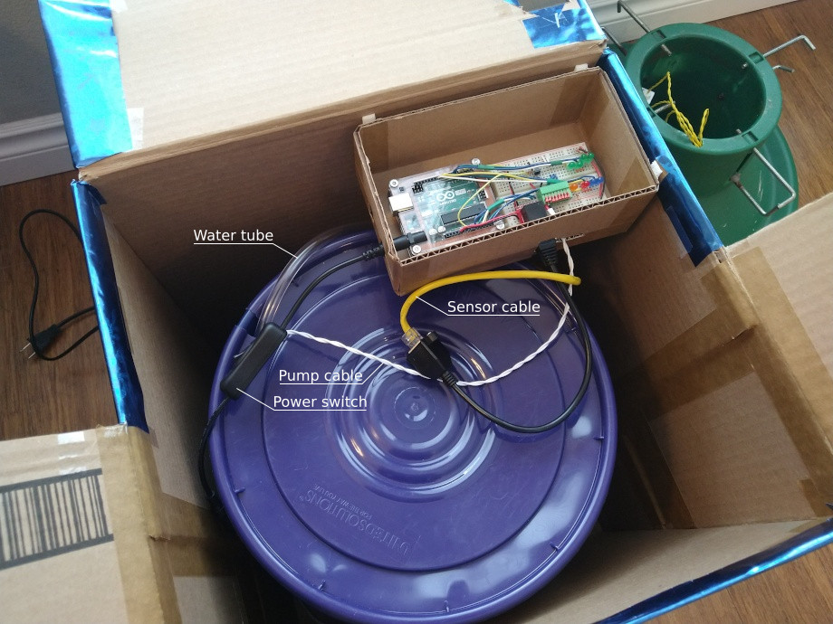
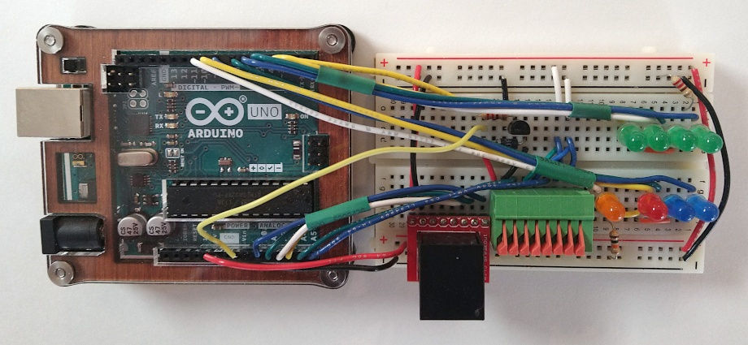
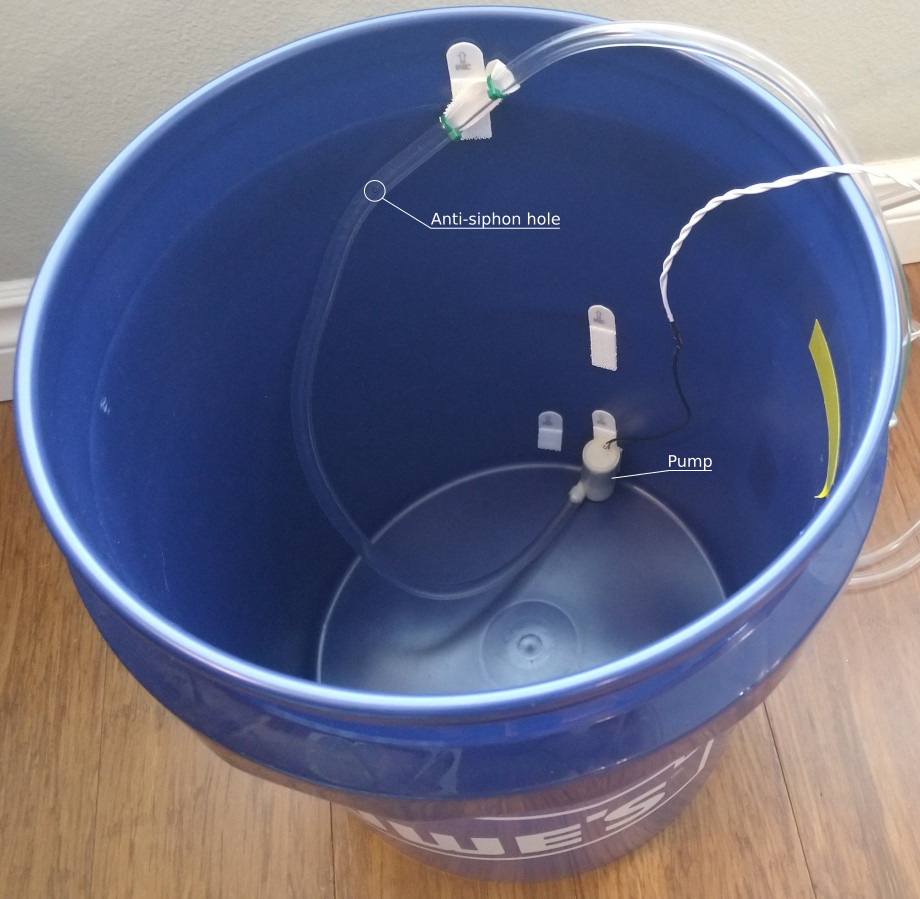
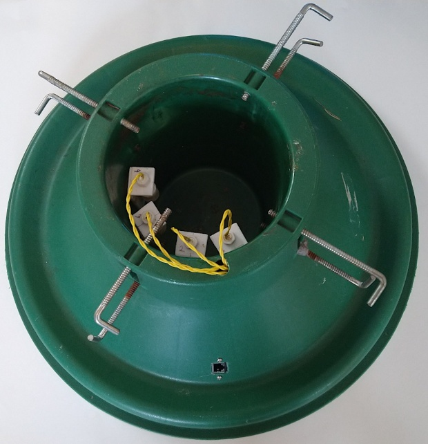
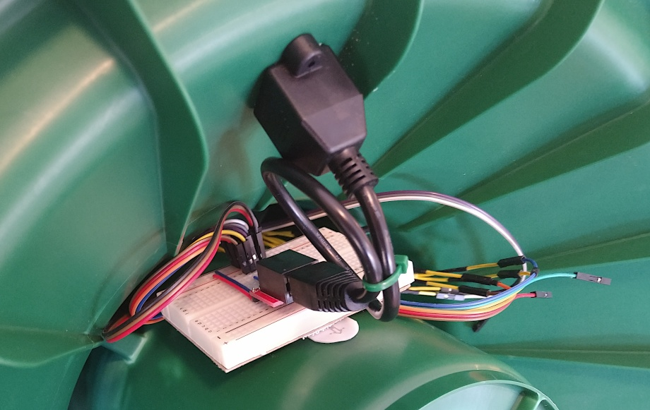

# Photo Gallery

## Closed view

The sensor cable and water tube can be hidden under a tree skirt in a real setup.

## Waterer

### Open view

A spare Cat5 panel mount/extender (shown here) is optional to make plugging and unplugging the sensor cable easier.

### Electronics

### Bucket setup

A small hole is drilled in the water tube inside the bucket but above the water line to prevent siphoning. When the pump is on, some water sprays out the hole. Make sure the lid is on tight and the spray is aimed away from the access hole so it all stays in the bucket.

## Stand

### Top view

The tree supports on the side of the stand with the sensors are extended further to prevent the tree from hitting the sensors. The tree sits slightly off-center in the stand.

### Underside

This could be done a lot cleaner. The extra wires are left over from a previous version that used a different type of sensor. The panel mount Cat5 extender allows plugging and unplugging the sensor cable even when the tree is in the stand.
